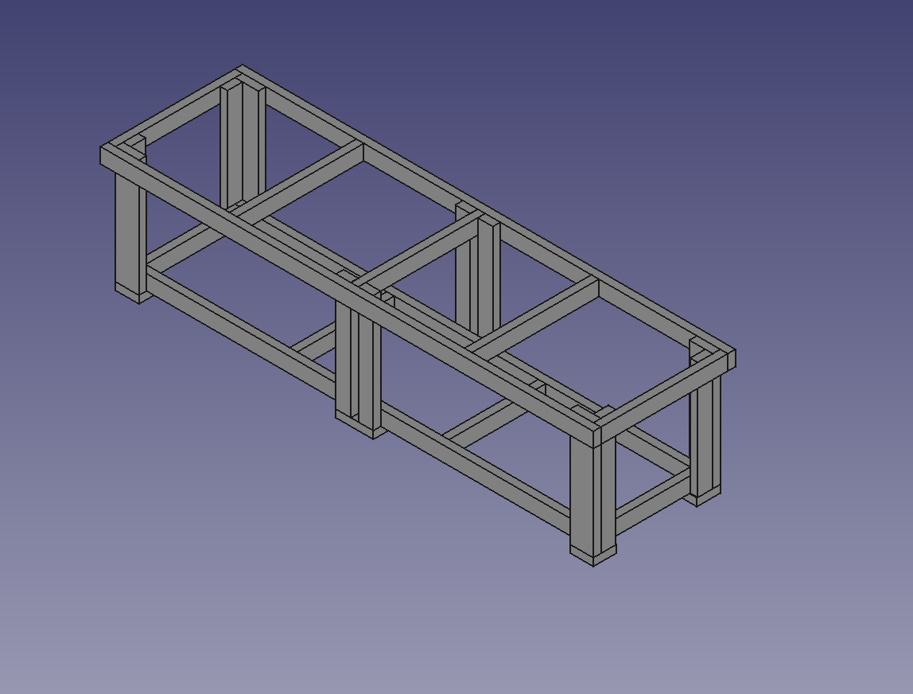
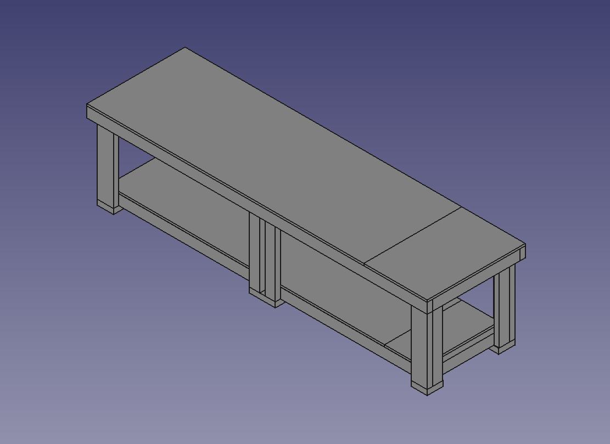

# Shed Workbench

max length 2950mm

2970mm between beams however allowing 20mm

max width not concerned

## supplies

90mm x 45mm x 3m as replacement for 2x4

https://www.bunnings.com.au/treated-pine-outdoor-timber-framing-90-x-45mm_p8032162

140mm x 45mm x 3m as replacement for 2x6

https://www.bunnings.com.au/treated-pine-outdoor-timber-framing-140-x-45mm_p8032254

MDF 1200 x 2400mm
https://www.bunnings.com.au/18mm-standard-mdf_p0590060

## based on

https://www.shanty-2-chic.com/2014/01/dig-workbench-free-plans.html

### Base frame lengths

| quantity | measurement | total length |
|----------|-------------|--------------|
| 5        | 45 x 90 x 580 | 2900mm |
| 2        | 45 x 90 x 2770 | 5540mm |

total length

### Top frame lengths

| quantity | measurement | total length |
|----------|-------------|--------------|
| 5        | 45 x 90 x 760 | 3800mm |
| 2        | 45 x 90 x 2950 | 5900mm |

## Legs

| quantity | measurement | total length |
|----------|-------------|--------------|
| 8        | 45 x 90 x 700 | 5600mm |
| 4        | 45 x 140 x 700 | 2800mm |

## feet

| quantity | measurement | total length |
|----------|-------------|--------------|
| 2        | 45 x 140 x 224 | 448mm |
| 4        | 45 x 140 x 140 | 560mm |

## materials required

| quantity | measurement | total length |
|----------|-------------| --------------|
| 8    | 45 x 90 x 3000 | 24000mm |
| 1    | 45 x 140 x 3000 | 3000mm |
| 1    | 45 x 140 x 1000 | 1000mm |

